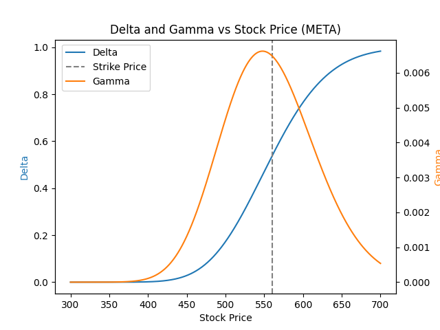

[Options_Greeks_Model_README.md](https://github.com/user-attachments/files/30624053/Options_Greeks_Model_README.md)
# Black-Scholes Options Pricing & Greeks Model — META

## Overview
A from-scratch Python implementation of the Black-Scholes options pricing model, calculating the theoretical fair value of an at-the-money META call option along with all four core Greeks (Delta, Gamma, Vega, Theta). Built to understand the mechanics options traders and market makers use daily to price contracts and manage risk exposure.

## Methodology
- **Data:** Current META price and 1-year historical daily returns pulled via the `yfinance` API. Annualized volatility calculated from the standard deviation of daily returns (scaled by √252).
- **Inputs:** Stock price (S) from live market data; strike price (K) set at-the-money (close to the current stock price); time to expiration (T) of 30 days, expressed as a fraction of a year; risk-free rate (r) approximated at 5%; volatility (σ) from historical daily returns.
- **Pricing:** The Black-Scholes formula was implemented as custom Python functions (rather than a pre-built library) to price a European call option and derive each Greek analytically:
  - **Delta** — sensitivity of the option price to a $1 move in the underlying stock.
  - **Gamma** — sensitivity of Delta itself to a $1 move in the underlying (peaks at-the-money).
  - **Vega** — sensitivity of the option price to a 1 percentage point change in implied volatility.
  - **Theta** — daily value lost purely from time decay.
- **Visualization:** Delta and Gamma were recalculated across a simulated range of stock prices ($300–$700) and plotted on a dual-axis chart, since Gamma's much smaller natural scale is otherwise crushed flat next to Delta's 0-to-1 range.

## Tools
Python, NumPy, SciPy (`scipy.stats.norm`), pandas, yfinance, matplotlib, Google Colab.

## Results (META, Strike $560, 30 Days to Expiration)

| Metric | Value |
|---|---|
| Stock price (S) | $556.71 |
| Annualized volatility (σ) | 38.16% |
| Call option price | $23.81 |
| Delta | 0.515 |
| Gamma | 0.00655 |
| Vega (per 1% vol move) | $0.636 |
| Theta (per day) | -$0.441 |

## Key Insight
Delta traces a smooth S-curve from near 0 (deep out-of-the-money) to near 1 (deep in-the-money), consistent with its interpretation as the approximate probability of finishing in the money. Gamma peaks sharply around the strike price and falls off on either side — visual confirmation that an option's sensitivity is least stable, and therefore riskiest to hedge, exactly when the stock is trading closest to the strike. This is the same dynamic that drives "pin risk" for market makers holding at-the-money positions close to expiration.

## How to Run
1. Open the notebook in Google Colab.
2. Run all cells in order (data pull → pricing function → Greek functions → visualization).
3. Adjust the ticker, strike price, or time to expiration to price different contracts.
